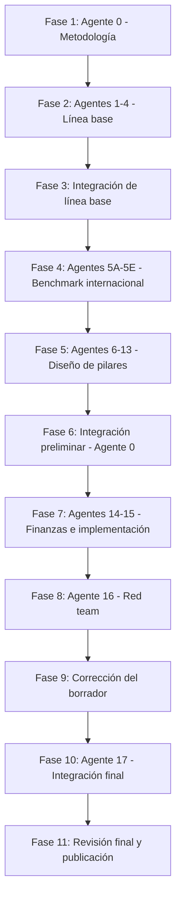

# Proyecto Nacional de Transformación del Fútbol Mexicano (PNTFM)

**Horizonte:** 2026–2046 (20 años)
**Estado actual:** Fase 1 completada — pendiente de aprobación para iniciar Fase 2
**Fecha de entrega Fase 1:** 2026-07-23
**Responsable de esta fase:** Agente 0 — Director General de Investigación

---

## Pregunta central del proyecto

> ¿Qué tendría que cambiar en México, desde la iniciación infantil hasta la Selección Nacional, para construir durante los próximos 20 años un sistema que produzca suficientes jugadores, entrenadores, clubes, competencias e instituciones de nivel mundial?

El objetivo **no** es prometer un campeonato mundial. Es construir un sistema sostenible que aumente de manera significativa y medible la probabilidad de producir jugadores de élite, entrenadores de calidad, clubes sólidos, selecciones juveniles consistentes y una Selección Mayor que compita regularmente por cuartos de final y semifinales de Copas del Mundo.

---

## Índice de entregables de la Fase 1

| # | Documento | Contenido |
|---|-----------|-----------|
| 01 | [Manual metodológico](fase-1/01-manual-metodologico.md) | Principios rectores, fuentes, clasificación de evidencia, tratamiento de incertidumbre, periodos, unidad territorial, definiciones operativas |
| 02 | [Taxonomía](fase-1/02-taxonomia.md) | Clasificación única de actores, activos, competencias, etapas formativas, territorios e indicadores |
| 03 | [Matriz de agentes y dependencias](fase-1/03-matriz-agentes.md) | Los 18 agentes, sus alcances, insumos, entregables y orden de ejecución |
| 04 | [Plantillas](fase-1/04-plantillas.md) | Plantilla de entregable de agente, evaluación de activos, benchmark por país, justificación de nuevas estructuras, pilotos, indicadores y riesgos |
| 05 | [Registro maestro de preguntas](fase-1/05-registro-preguntas.md) | Preguntas de investigación por agente, con ID, fuente esperada y estado |
| 06 | [Catálogo de fuentes](fase-1/06-catalogo-fuentes.md) | Fuentes primarias y secundarias priorizadas, con nivel de evidencia esperado |
| 07 | [Registros maestros](fase-1/07-registros-maestros.md) | Registros de supuestos, contradicciones y decisiones (con entradas iniciales) |
| 08 | [Puertas de control](fase-1/08-puertas-de-control.md) | Los 8 controles de calidad con criterios verificables de avance |
| 09 | [Calendario y plan de trabajo](fase-1/09-calendario.md) | Secuencia de las 11 fases, duración, hitos y entregables |
| 10 | [Criterios reformar vs. crear](fase-1/10-criterios-reformar-vs-crear.md) | Jerarquía de intervención, regla del 70%, árbol de decisión y cuestionario de 14 puntos |
| 11 | [Riesgos iniciales](fase-1/11-riesgos-iniciales.md) | Registro de riesgos del proyecto de investigación y del proyecto nacional |
| 12 | [Brief para la Fase 2](fase-1/12-brief-fase-2.md) | Paquete de arranque para los Agentes 1, 2, 3 y 4 (línea base mexicana) |

---

## Orden de ejecución (resumen)

Cada transición entre fases está condicionada por una **puerta de control** (documento 08). Ninguna fase avanza sin cumplir los criterios de la puerta anterior.

---

## Regla de oro del proyecto

**México no comienza desde cero.** Toda recomendación sigue la jerarquía obligatoria de intervención: aprovechar → corregir → integrar → escalar → redistribuir → cambiar reglas → complementar → crear (solo como último recurso). Al menos el 70% de las acciones de los primeros 4 años debe basarse en reformar, integrar, aprovechar, ampliar, profesionalizar, auditar, digitalizar o escalar capacidades existentes.
