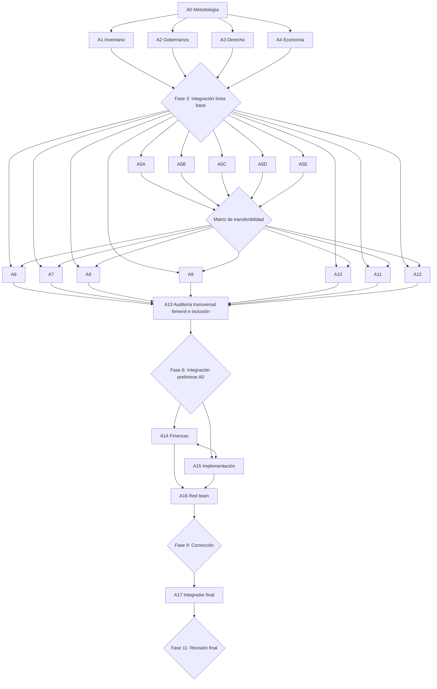

# 03. Matriz de Agentes y Dependencias

**Proyecto:** PNTFM · **Fase:** 1 · **Autor:** Agente 0 · **Versión:** 1.0

---

## 1. Matriz de agentes

| ID | Agente | Ámbito | Fase | Insumos requeridos | Entregable principal | Preguntas asignadas |
|----|--------|--------|------|--------------------|----------------------|---------------------|
| A0 | Director de investigación | Metodología, coordinación, integración, controles | 1, 3, 6, 9, 11 | Mandato del proyecto | Manual metodológico, integraciones, resolución de contradicciones | Q-MET-* |
| A1 | Capacidades existentes | Inventario nacional: instituciones, infraestructura, programas, competencias, capital humano, datos, convenios, fondos, legado 2026, capacidad ociosa | 2 | Docs. 01–06 | Inventario nacional clasificado (E1–E13) + mapa de capacidad ociosa | Q-INV-* |
| A2 | Gobernanza y poder | FMF, Liga MX, dueños, clubes, televisoras, patrocinadores, gobierno, FIFA, Concacaf, agentes, medios; conflictos de interés | 2 | Docs. 01–06 | Mapa de poder + matriz de conflictos de interés + ganadores/perdedores del statu quo | Q-GOB-* |
| A3 | Derecho y regulación | Leyes, reglamentos, competencia económica, multipropiedad, menores, agentes, transferencias, datos, educación, límites de injerencia estatal (FIFA) | 2 | Docs. 01–06 | Diagnóstico jurídico + mapa de vías de reforma (federativa/reglamentaria/legislativa/convenio) | Q-JUR-* |
| A4 | Economía del fútbol | Ingresos, costos, incentivos, transferencias, salarios, extranjeros, formación, exportación, distribución; pregunta clave: ¿por qué es más rentable el extranjero promedio que formar al mexicano? | 2 | Docs. 01–06 | Diagnóstico económico + modelo de incentivos actual | Q-ECO-* |
| A5A | Benchmark Europa Occidental | España, Portugal, Francia, Alemania, Países Bajos, Bélgica | 4 | Línea base integrada (Fase 3) | Fichas país (formato 16 preguntas) + transferibilidad | Q-BEN-EUR-* |
| A5B | Benchmark países pequeños/comunitarios | Noruega, Islandia, Dinamarca, Suecia, Croacia, Uruguay | 4 | Línea base integrada | Fichas país + transferibilidad | Q-BEN-PEQ-* |
| A5C | Benchmark África y diáspora | Marruecos, Senegal, Ghana, Costa de Marfil | 4 | Línea base integrada | Fichas país + transferibilidad (énfasis: diáspora/binacionales, academias, exportación) | Q-BEN-AFR-* |
| A5D | Benchmark América | Estados Unidos, Canadá, Argentina, Brasil, Colombia | 4 | Línea base integrada | Fichas país + transferibilidad (énfasis: vecindad con EUA, exportación sudamericana) | Q-BEN-AME-* |
| A5E | Benchmark Asia y Oceanía | Japón, Corea del Sur, Australia | 4 | Línea base integrada | Fichas país + transferibilidad (énfasis: planeación a largo plazo, J-League 100-year vision) | Q-BEN-ASI-* |
| A6 | Formación y fuerzas básicas | Pirámide 5–23, estándares de academias, clasificación, embudo del jugador | 5 | Línea base + benchmark + restricciones | Diseño Pilares 3 y 5 + embudo cuantificado | Q-FOR-* |
| A7 | Escuela, universidad y comunidad | Modelo híbrido escolar-universitario-comunitario, carrera dual | 5 | Línea base + benchmark | Diseño Pilar 4 | Q-ESC-* |
| A8 | Entrenadores y ciencia | Licencias, formación, recertificación, ciencia del deporte, capital humano por mil jugadores | 5 | Línea base + benchmark | Diseño Pilar 8 | Q-ENT-* |
| A9 | Infraestructura | Capacidad, uso, brechas territoriales; prioridad mantenimiento > rehabilitación > uso compartido > ampliación > construcción | 5 | Inventario A1 + territorio | Diseño Pilar 10 | Q-INF-* |
| A10 | Datos y scouting | Identificador único, interoperabilidad, protección de datos, detección de sesgos | 5 | Inventario de sistemas A1 | Diseño Pilar 9 | Q-DAT-* |
| A11 | Selecciones | Identidad metodológica, microciclos, binacionales, diáspora, coordinación de categorías | 5 | Línea base + benchmark | Diseño Pilar 13 | Q-SEL-* |
| A12 | Cultura y medios | Narrativa, identidad, papel de televisoras/plataformas/periodistas; sin propaganda | 5 | Mapa de poder A2 | Diseño Pilar 12 | Q-CUL-* |
| A13 | Fútbol femenil e inclusión | Auditoría transversal de todos los pilares (no sistema separado) + protección de menores | 5 | Todos los diseños de Fase 5 | Diseño Pilares 11 y marco de protección + dictamen transversal | Q-FEM-* |
| A14 | Finanzas | Costeo, escenarios (conservador/intermedio/transformador), costos unitarios, sensibilidad, fuentes permanentes | 7 | Diseño integrado (Fase 6) | Presupuesto de 20 años + dictamen de viabilidad | Q-FIN-* |
| A15 | Implementación | Cronograma (100 días / año 1 / 2–4 / 5–8 / 9–12 / 13–20), pilotos, RACI, gestión del cambio, coaliciones | 7 | Diseño integrado + presupuesto | Hoja de ruta + cartera de pilotos + RACI | Q-IMP-* |
| A16 | Red team | Ataque a supuestos, datos, costos, calendarios, incentivos, legalidad, captura, FIFA, dueños, desigualdad | 8 | Borrador completo (Fase 7 reconciliada) | Informe de críticas con veredicto por recomendación (mantener/modificar/eliminar) | Q-RED-* |
| A17 | Integrador final | Consolidación, trazabilidad, priorización, redacción del entregable final (37 secciones) | 10 | Todo lo anterior + respuestas al red team | Documento ejecutivo, técnico, presupuesto, hoja de ruta, RACI, dashboard, riesgos, propuesta regulatoria, anexos, resumen de medios, presentación | — |

---

## 2. Grafo de dependencias

Notas de dependencia:
- **A13 corre al final de la Fase 5** para auditar transversalmente los diseños de A6–A12, además de producir su propio pilar. Recibe borradores, no versiones finales.
- **A14 y A15 iteran entre sí** (presupuesto ↔ cronograma) hasta reconciliar: toda acción con costo, todo costo con fuente, toda fuente con calendario.
- **Ningún agente de diseño (A6–A13) corre sin línea base y benchmark aprobados** (puertas 2 y 3).

---

## 3. Paquete de insumos común para agentes de diseño (Fase 5)

Cada agente A6–A13 recibe obligatoriamente: (1) línea base integrada, (2) benchmark y matriz de transferibilidad, (3) restricciones mexicanas (Parte VI del mandato, desarrollada por A1–A4), (4) inventario de activos con clasificación E1–E13, (5) mapa de poder, (6) diagnóstico jurídico, (7) diagnóstico económico, (8) manual metodológico y taxonomía.

## 4. Reglas de coordinación

1. **Hallazgos transferidos:** hallazgo fuera de ámbito → se registra con destinatario, no se desarrolla.
2. **Contradicciones:** dos agentes en desacuerdo → entrada en registro CTR; resuelve A0 en la integración siguiente, con decisión motivada en el registro DEC.
3. **Duplicidades:** si dos agentes proponen estructuras similares, A0 las fusiona o elimina en la Fase 6.
4. **Cascada de cambios:** toda corrección post–red-team que altere costos o tiempos regresa a A14/A15 antes de pasar a A17.
